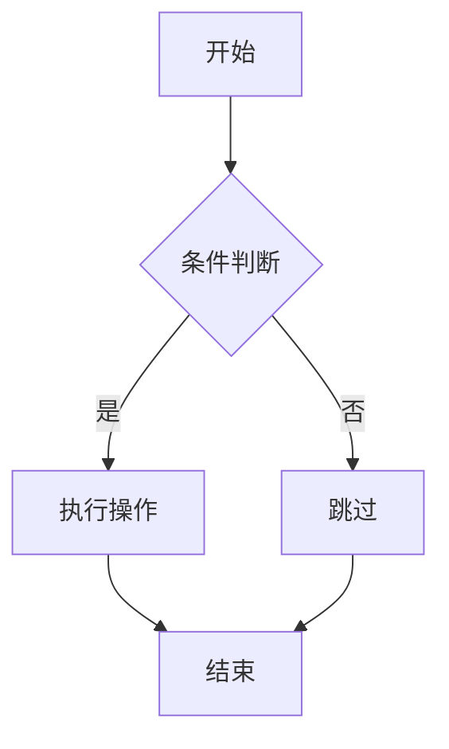
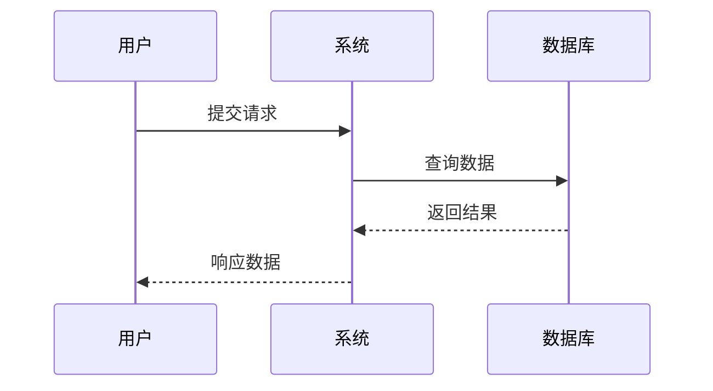
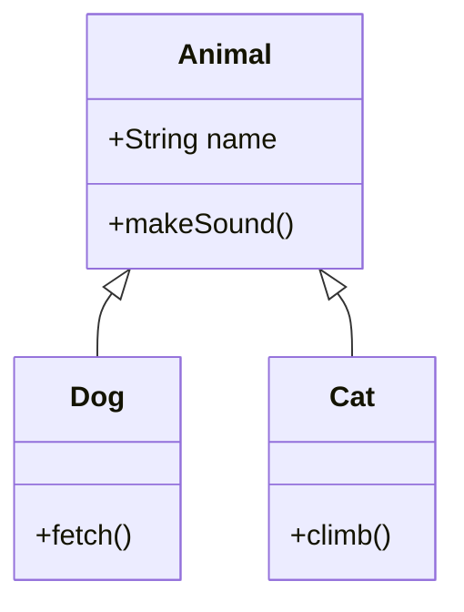
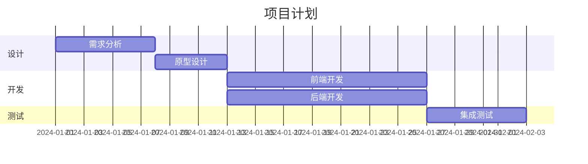

# Mermaid 图表示例

VitePress 支持通过 Mermaid 渲染流程图、时序图、类图等。

## 流程图

```mermaid
graph TD
    A[开始] --> B{条件判断}
    B -->|是| C[执行操作]
    B -->|否| D[跳过]
    C --> E[结束]
    D --> E
```

## 时序图

```mermaid
sequenceDiagram
    participant 用户
    participant 系统
    participant 数据库
    用户->>系统: 提交请求
    系统->>数据库: 查询数据
    数据库-->>系统: 返回结果
    系统-->>用户: 响应数据
```

## 类图

```mermaid
classDiagram
    class Animal {
        +String name
        +makeSound()
    }
    class Dog {
        +fetch()
    }
    class Cat {
        +climb()
    }
    Animal <|-- Dog
    Animal <|-- Cat
```

## 甘特图

```mermaid
gantt
    title 项目计划
    dateFormat  YYYY-MM-DD
    section 设计
    需求分析           :a1, 2024-01-01, 7d
    原型设计           :a2, after a1, 5d
    section 开发
    前端开发           :a3, after a2, 14d
    后端开发           :a4, after a2, 14d
    section 测试
    集成测试           :a5, after a3, 7d
```
